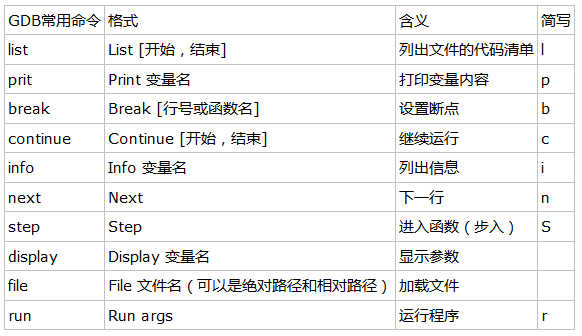

#GDB 调试
---
###gdb常用命令列表

###break断点的添加方法
1. 给行号加断点。使用 break或b加行号，例如`b 5`

2. 给函数名加断点。使用 break或b加函数名，例如`b main`

3. 给程序地址加断点。使用 break或b加*加地址，例如`b *0x80483ed`

###condition条件
> 这个功能很强大，可以在我们设置的条件成立时，自动停止当前的程序，先使用break(或者watch也可以）设置断点，然后用condition来修改这个断点的停止（就是断）的条件。使用方法如下:  
`condition <break_numer> <expression>`  
变回一般断点只要把上面的expression去掉即可。

###ignore忽略某个断点多少次
> ignore格式如下:  
`ignore <break_number> count`

